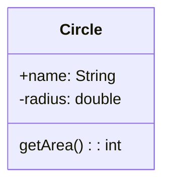

# Classes

#### Definition
```java
class Circle{
	double radius = 1.0;
	// Init method
	Circle(double r){
		radius = r;
	}
	double getArea(){
		return Math.PI * radius * radius;
	}
}
Circle circle1 = new Circle();
```

- A *static* method can be invoked from the **Class**
- An *instance* method can only be invoked on a specific instance
- Objects are reference data type

#### UML (Unified Modeling Language)

- \+ : public
- \- : private
- <u>underline</u> : static

## Inheritance 
```java
public class Employee extends Person {
public Employee{
    super(); // ALWAYS IMPLIED IF NOT SPECIFIED
    System.out.println("Hey");
    }
}
```
- `super()` acts as the constructor of the superclass and always comes first 
- `super()` is like copy pasting the subclass's constructor into the subclass's constructor 