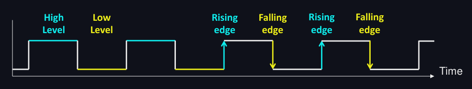
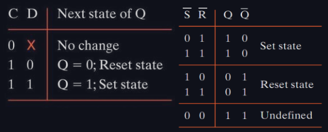
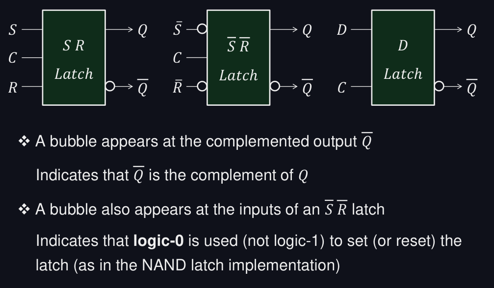
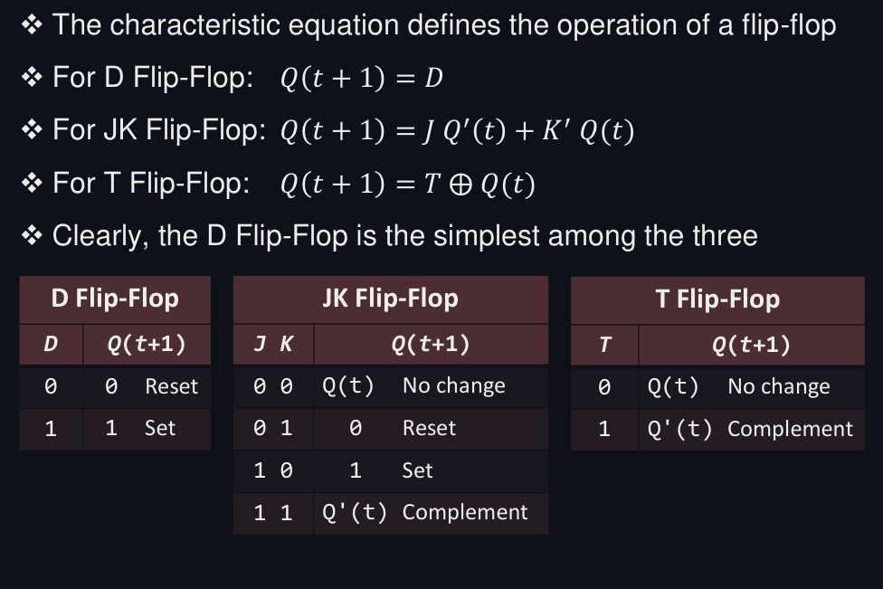
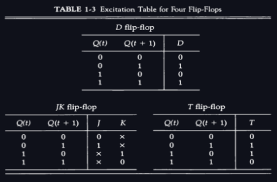
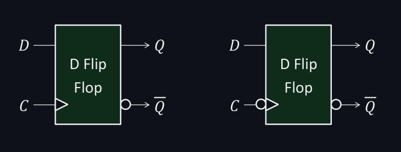
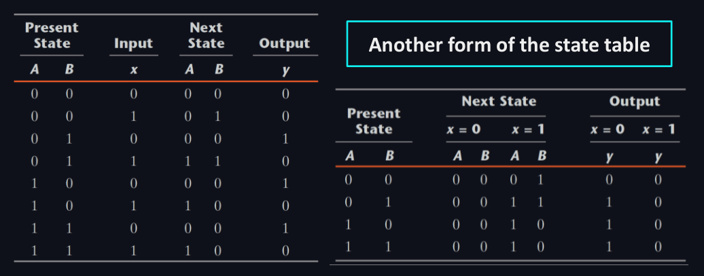
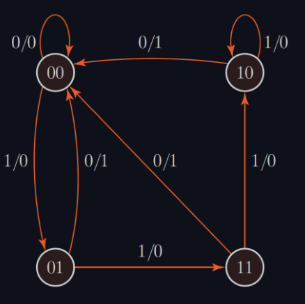
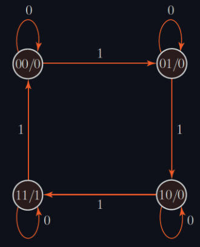

- **Combinational** circuits rely exclusively on the inputs / fucntion of inputs 
- **Sequential** circuits are function of inputs and internal memory
	1. **Synchronous** : controlled by a clock
	2. **Asynchronous** : changes can happen at any instance of time  

## Clock

**High Level / Positive Pulse** : when the level of the clock is 1
**Low Level / Negative Pulse**: when the level of the clock is 0
**Rising Edge**: when the clock goes from 0 to 1
**Falling Edge**: when the clock goes from 1 down to 0

## Latches
A latch is **level-sensitive**
Final value of output 𝑄 is uncertain > not used in synchronous circuits

### Graphic Symbols

## Flip-Flops

### Graphic Symbols
The circle on the clock input indicates a **falling edge-triggered** FF

## State Table

## State Diagram
State is in the bubble and 0/0 stands for INPUT/OUTPUT  
    
00/0 in the bubble stands for STATE/OUTPUT and the arrows contain the input  
  