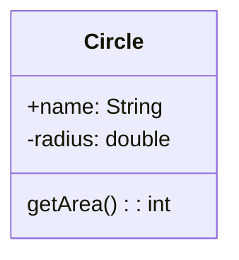

## Classes

Objects are reference data type


#### Definition
```java
class Circle{
	double radius = 1.0;
	// Init method
	Circle(double r){
		radius = r;
	}
	double getArea(){
		return Math.PI * radius * radius;
	}
}
Circle circle1 = new Circle();
```

- A *static* method can be invoked from the **Class**
- An *instance* method can only be invoked on a specific instance

#### UML (Unified Modeling Language)

- \+ : public
- \- : private
- <u>underline</u> : static
